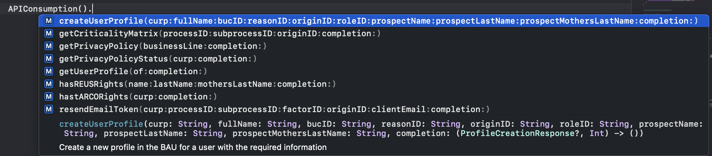

<p align="center"></p>
</a>

  <h3 align="center">Motor de Autenticación Universal - iOS</h3>

  <p align="center">MAU</p>
  
<!-- TABLE OF CONTENTS -->
<details open="open">
  <summary>Tabla de contenidos</summary>
  <ol>
    <li>
      <a href="#acerca-del-proyecto">Acerca del proyecto</a>
      <ul>
        <li><a href="#tecnologías-utilizadas">Tecnologías utilizadas</a></li>
      </ul>
    </li>
    <li>
      <a href="#introducción">Introducción</a>
      <ul>
        <li><a href="#prerrequisitos">Prerrequisitos</a></li>
        <li><a href="#instalación">Instalación</a></li>
      </ul>
    </li>
    <li><a href="#uso">Uso</a></li>
    <li><a href="#autor">Autor</a></li>
  </ol>
</details>


<!-- ABOUT THE PROJECT -->

## Acerca del proyecto

Biblioteca del Motor de Autenticación Universal que incluye las siguientes características:
* Facilidad para autenticar a un cliente registrado en las aplicaciones de Profuturo.
* Incluye los siguientes consumos de servicios web:
	* Obtener perfil de usuario
	* Crear perfil de usuario
	* Obtener matriz de criticidad
	* Obtener aviso de privacidad
	* Obtener estado del aviso de privacidad
	* Guardar respuesta del aviso de privacidad
	* Consultar derechos ARCO
	* Consultar derechos REUS
	* Enviar y reenviar token (OTP) por SMS
	* Enviar y reenviar token (Email) por Email
	* Validar token (OTP)
	

### Tecnologías utilizadas

La biblioteca fue creada utilizando la tecnología <b>Swift</b> y utiliza los siguientes pods para su funcionamiento:
* [SVPinView](https://github.com/xornorik/SVPinView)
* [Alamofire (4.8.1)](https://github.com/Alamofire/Alamofire)
* [AlamofireObjectMapper (5.2.0)](https://github.com/tristanhimmelman/AlamofireObjectMapper)
* [Lottie](https://github.com/airbnb/lottie-ios)
* [ReachabilitySwift (5.2.0)](https://github.com/ashleymills/Reachability.swift)
* [FWFaceAuth (5.2.0)](https://github.com/grupo-profuturo/ios-facephi-framework-pod)

<!-- GETTING STARTED -->

## Introducción

La biblioteca se encuentra disponible en Cocoapods y a continuación se mostrará lo necesario para instalarla.

### Prerrequisitos

Necesitamos Cocoapods en nuestra computadora, se instala utilizando el siguiente comando:
* cocoapods
  ```sh
  sudo gem install cocoapods
  ```

### Instalación

1. En la terminal, navega a tu proyecto de Xcode e ingresa:
   ```ruby
   pod init
   ```
2. Abre el archivo Podfile que se creó e ingresa lo siguiente en la lista de frameworks:
   ```ruby
   pod 'MAULibrary'
   ```
3. Regresa a la terminal e ingresa:
   ```ruby
   pod install
   ```


<!-- USAGE EXAMPLES -->

## Uso

### Motor de Autenticación

### Consumo de servicios
Para el consumo de servicios del MAU se utilizará la clase <b>APIConsumption</b>, esta se tiene que instanciar y llamar la función del servicio que se desea consumir (todas traen documentación explícita de lo que se pide y lo que se obtiene). A continuación se muestra un ejemplo de algunas funciones disponibles:

<p align="center"></p>

Una vez que se seleccionó el servicio a consumir, se ingresan los parámetros y se utiliza el closure para obtener la información una vez que el servicio haya terminado de consultarse (Toda la información que se obtiene viene documentada en el código).

    ```swift
   APIConsumption().getUserProfile(of: "CURP", completion: (ProfileResponse?, Int) -> ())
   ```

   ```swift
   APIConsumption().getUserProfile(of: "CURP") { profileResponse, code in 
   
   }
   ```

## Autor
Ángel Eduardo Domínguez Delgado
adomingd@everis.com